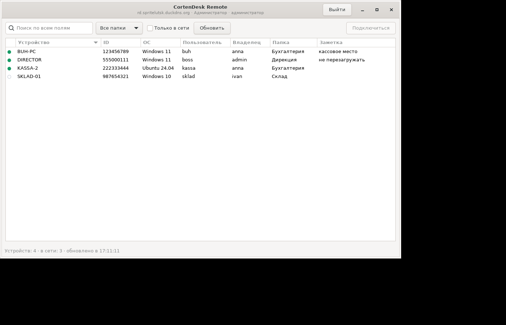
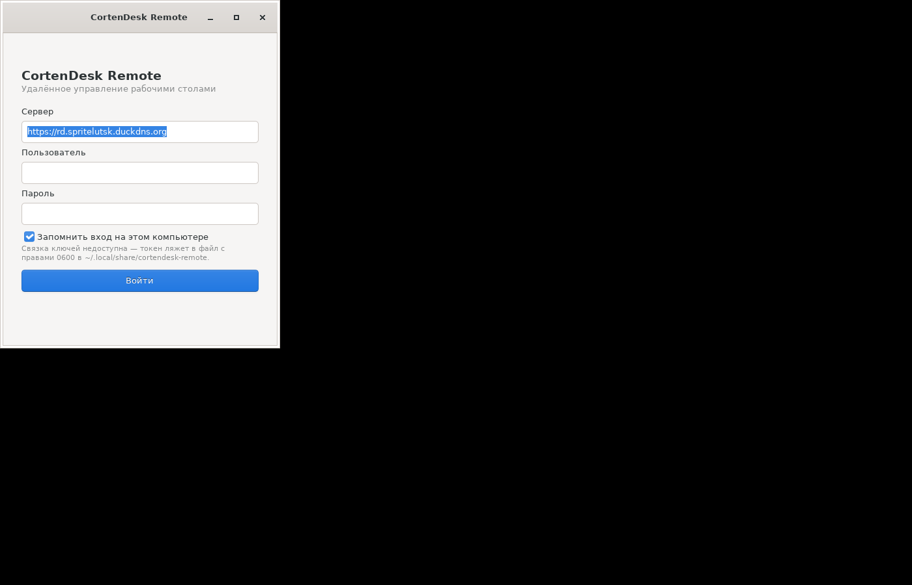
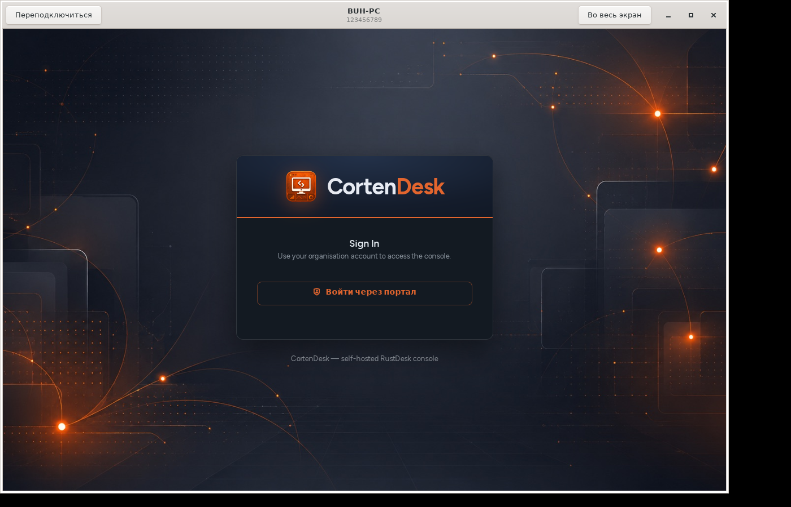

# CortenDesk Remote (Linux) — GTK-клиент и пакет .deb для arm64

Четвёртая реализация того же приложения (рядом: `../winclient` на C#/WPF,
`../winclient-electron` на Electron, `../winclient-python` на Tkinter):
список устройств из консоли CortenDesk с присутствием, поиском и фильтрами,
а сеанс — нативный веб-клиент CortenDesk во встроенном браузере.

**Стек:** Python 3 + GTK 3 через PyGObject, встроенный браузер — WebKit2GTK.
Зависимостей из pip нет вообще: всё берётся из системных пакетов Debian.







*Скриншоты сняты с работающего приложения. Последний — окно сеанса, которое
загрузило страницу с живого сервера CortenDesk.*

## Чем эта версия лучше Windows-собратьев

Не «другая», а именно лучше — Linux позволяет то, чего не дают Windows-версии:

- **Окно сеанса живёт в том же процессе.** WebKit2GTK — часть GTK-стека, так
  что встроенный браузер работает в общем цикле событий. В Python-версии для
  Windows приходилось запускать сеанс отдельным процессом: и Tkinter, и
  pywebview требуют главного потока и в одном процессе не уживаются.
- **Точка присутствия действительно зелёная.** У `Gtk.CellRendererText` цвет
  берётся из отдельной колонки модели, поэтому красится ровно ячейка. В
  Tkinter `Treeview` красить одну ячейку нельзя — там пришлось обойтись
  залитым и пустым кружком.
- **Фильтрация без перестройки таблицы** — канон GTK: `ListStore` →
  `TreeModelFilter` (поиск и фильтры) → `TreeModelSort` (сортировка по клику
  на заголовок) → `TreeView`.
- **Нативный вид**: `Gtk.HeaderBar`, системная тема, никакой самодельной
  палитры. Приложение выглядит как часть рабочего стола, а не как гость.

## Что оно делает и чего не делает

Делает: вход по учётной записи CortenDesk (`POST /api/login`), список устройств
(`GET /api/peers`) с присутствием, поиск по всем полям, фильтр по папке
(`/api/device-group/accessible`), фильтр «только в сети», сортировка по любому
столбцу, автообновление раз в 15 секунд, окно сеанса с F11 на весь экран,
контекстное меню строки (подключиться / копировать ID / открыть в браузере),
запоминание входа.

Не делает — и это осознанно: **не реализует протокол RustDesk сам**. Захват
экрана, пробивка NAT, VP8/VP9/H.264/AV1 и шифрование сеанса — это целиком
RustDesk. Приложение открывает готовый нативный веб-клиент CortenDesk.

## Две авторизации — так и задумано

| Что | Чем авторизуется | Где живёт |
|---|---|---|
| Список устройств, папки | Bearer клиентского API (`/api/login`) | связка ключей, иначе файл 0600 |
| Страница сеанса `/webclient` | Обычная сессия консоли (middleware `auth`) | cookie в `~/.local/share/cortendesk-remote/webkit` |

Bearer в страницу консоли не подставить — это разные механизмы аутентификации
на стороне сервера. Поэтому первый сеанс на новой машине покажет форму входа
консоли (а на вашем сервере — сразу кнопку «Войти через портал»: Caddy
переписывает голый `GET /login` в `/login/oidc`). Cookie хранится в собственном
`WebsiteDataManager`, дальше вход не спрашивается.

Окно сеанса доводит дело до конца само: если после логина сервер увёл на
главную консоли, окно возвращается на `/webclient?id=…` — до трёх попыток,
чтобы не зациклиться.

## Где лежит токен

DPAPI из Windows-версий здесь нет, поэтому по возможности используется
**Secret Service** (GNOME Keyring, KWallet и прочие — через
`python3-secretstorage`). Если агента ключей в сеансе нет, токен пишется в файл
с правами `0600` в `~/.local/share/cortendesk-remote/`. Это заметно слабее, и
приложение честно пишет об этом прямо на экране входа — на скриншоте видно.
Отключается снятием галки «Запомнить вход».

## Установка

```bash
sudo apt install ./dist/cortendesk-remote_1.0.0_arm64.deb
```

`apt` сам подтянет зависимости. Ставить `dpkg -i` без `apt` не стоит — он их
не разрешает.

Зависимости пакета: `python3 (>= 3.11)`, `python3-gi`, `gir1.2-gtk-3.0`,
`gir1.2-webkit2-4.1`; рекомендуется `python3-secretstorage`.

После установки приложение появится в меню («CortenDesk Remote», раздел
«Интернет») и как команда `cortendesk-remote`.

## Сборка пакета

```bash
./tools/build_deb.sh              # arm64 (по умолчанию)
ARCH=amd64 ./tools/build_deb.sh
ARCH=all   ./tools/build_deb.sh
VERSION=1.1.0 MAINTAINER='Имя <mail@example.org>' ./tools/build_deb.sh
```

Собирается на любой машине с `dpkg-deb`: внутри только Python и данные, ничего
компилируемого, поэтому кросс-сборка под arm64 с x86_64 — это просто другое
значение поля `Architecture`.

**Честное замечание:** раз содержимое от архитектуры не зависит, по правилам
Debian корректнее было бы `Architecture: all` — такой пакет встанет и на arm64,
и на amd64. Собрано `arm64`, как и просили; `ARCH=all` даёт универсальный
вариант той же командой.

Поле `Maintainer` — заглушка на вашем домене, поменяйте на своё через
переменную `MAINTAINER`.

## Запуск из исходников

```bash
sudo apt install python3-gi gir1.2-gtk-3.0 gir1.2-webkit2-4.1 python3-secretstorage
python3 -m cortendesk_remote
python3 tools/preview_ui.py       # интерфейс на поддельных данных, без сервера
```

## Файлы

```
cortendesk_remote/
  __main__.py          точка входа
  api.py               REST-клиент на urllib (дословно как в ../winclient-python)
  store.py             настройки по XDG + токен в Secret Service либо в файл 0600
  app.py               Gtk.Application, переключение экранов
  ui_login.py          экран входа, тихая проверка сохранённого токена
  ui_devices.py        таблица, фильтры, сортировка, контекстное меню
  session.py           окно сеанса на WebKit2GTK и возврат на /webclient
  tasks.py             сеть в фоновом потоке, результат через GLib.idle_add
packaging/             .desktop, иконка, copyright
tools/build_deb.sh     сборка пакета
tools/preview_ui.py    предпросмотр интерфейса без сервера
dist/                  собранный .deb
```

## Что проверено

- Приложение запущено под Xvfb: экран входа, список устройств на поддельных
  данных, окно сеанса.
- Окно сеанса открыто на **живом** CortenDesk (`127.0.0.1:8080`): WebKit
  загрузил настоящую страницу входа консоли со ссылкой «Войти через портал»,
  а логика возврата корректно опознала её как страницу авторизации и **не**
  стала прыгать обратно (`попыток возврата: 0`).
- Пакет собран, распакован и запущен **из своего же** `/usr/bin/cortendesk-remote`
  с посторонним рабочим каталогом — то есть проверялся именно упакованный код.
- `md5sums` в пакете сходятся с содержимым.
- `api.py` ранее прогнан вживую против сервера: ошибка входа приходит с HTTP 200
  и телом `{"error":"Wrong credentials"}`, запрос устройств с негодным токеном
  даёт 401 → `ApiError(expired=True)`.

Найдено и исправлено по ходу проверки: `Gdk` импортировался без
`gi.require_version` (PyGIWarning: на машине с GTK4 мог подгрузиться не тот
`Gdk`), у контейнера экрана входа не было полей, и колонки ID/ОС/Папка
схлопывались в многоточие без явной минимальной ширины.

Предупреждение `Could not load a pixbuf from … Adwaita/assets/check-symbolic.svg`
в логе — артефакт тестового стенда (пакеты ставились с
`--no-install-recommends`, загрузчик SVG для gdk-pixbuf отсутствует). На
нормальном рабочем столе его не будет.

## Чего проверить не удалось

Пакет не устанавливался через `apt` по-настоящему: стенд — amd64, а пакет
собран для arm64. Проверялись распаковка, права, `md5sums` и запуск
распакованного кода. На arm64-машине команда установки — из раздела выше.
