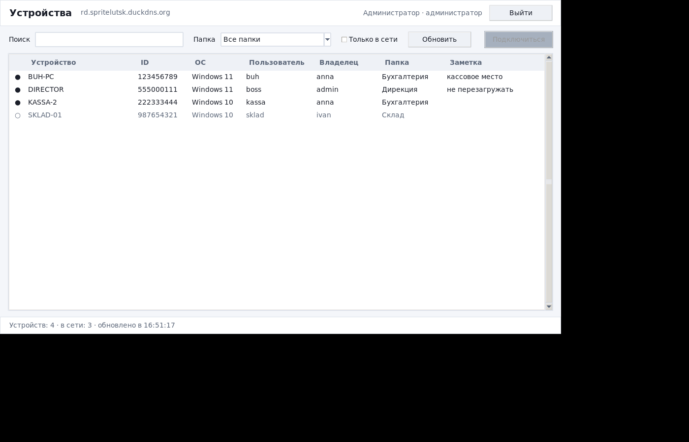
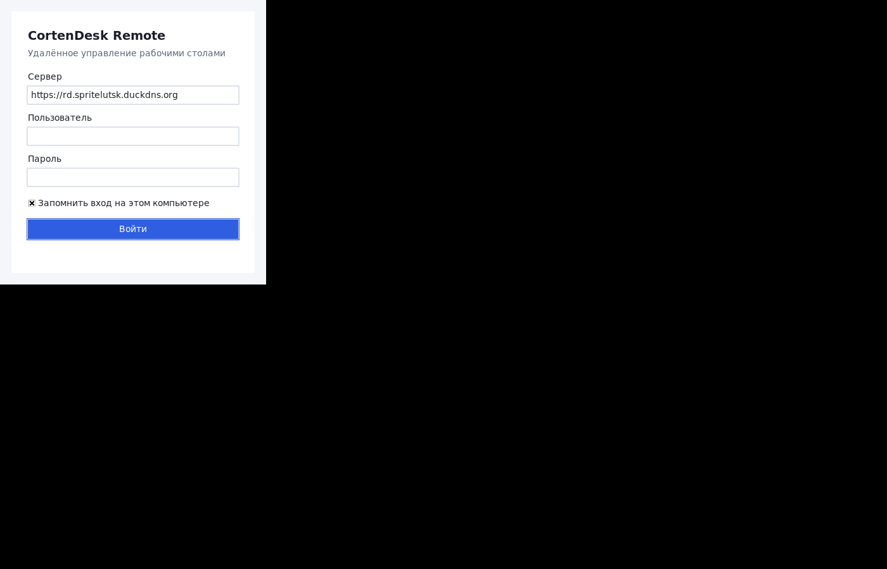
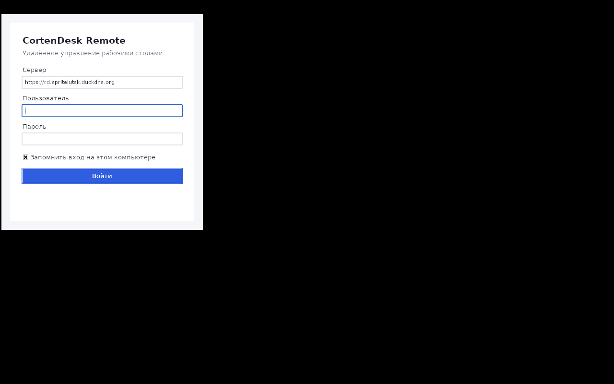

# CortenDesk Remote (Python) — десктопный клиент для Windows

Третья реализация того же приложения (рядом лежат `../winclient` на C#/WPF и
`../winclient-electron` на Electron): список устройств из консоли CortenDesk с
присутствием, поиском и фильтрами, а сеанс — нативный веб-клиент CortenDesk во
встроенном браузере.

**Стек:** Python 3.11+, Tkinter/ttk для интерфейса, `urllib` для HTTP — обе из
стандартной библиотеки. Единственная внешняя зависимость — `pywebview`, и та
нужна только окну сеанса.





*Скриншоты сняты с работающего приложения (Xvfb, поддельный API — см.
`tools/preview_ui.py`).*

## Чем отличается от соседних версий

Функционально — ничем, это осознанный порт один в один.

| | WPF | Electron | Python |
|---|---|---|---|
| Интерфейс | XAML | HTML | Tkinter/ttk |
| Движок сеанса | WebView2 | Chromium в комплекте | pywebview → WebView2 |
| Зависимости | .NET 8 + WebView2 | нет | Python + pywebview + WebView2 |
| Размер сборки | 1,3 / 162 МБ | 269 МБ | ~15 МБ через PyInstaller |
| Хранение токена | DPAPI | safeStorage | DPAPI через ctypes |

## Что оно делает и чего не делает

Делает: вход по учётной записи CortenDesk (`POST /api/login`), список устройств
(`GET /api/peers`) с индикатором «в сети», поиск по всем полям, фильтр по папке
(`/api/device-group/accessible`), фильтр «только в сети», сортировка по любому
столбцу, автообновление раз в 15 секунд, окно сеанса, контекстное меню строки
(подключиться / копировать ID / открыть в браузере), запоминание входа.

Не делает — и это осознанно: **не реализует протокол RustDesk сам**. Захват
экрана, пробивка NAT, VP8/VP9/H.264/AV1 и шифрование сеанса — это целиком
RustDesk. Приложение открывает готовый нативный веб-клиент CortenDesk.

## Две авторизации — так и задумано

| Что | Чем авторизуется | Где живёт |
|---|---|---|
| Список устройств, папки | Bearer клиентского API (`/api/login`) | `%APPDATA%\CortenDeskRemote\token.dat`, шифр DPAPI |
| Страница сеанса `/webclient` | Обычная сессия консоли (middleware `auth`) | cookie в `%APPDATA%\CortenDeskRemote\webview` |

Bearer в страницу консоли не подставить — это разные механизмы аутентификации
на стороне сервера. Поэтому первый сеанс на новой машине покажет форму входа
консоли (а на вашем сервере — сразу редирект на SSO портала: Caddy переписывает
голый `GET /login` в `/login/oidc`). Cookie сохраняется благодаря
`webview.start(private_mode=False, storage_path=…)`, дальше вход не спрашивается.

Окно сеанса доводит дело до конца само: если после логина сервер увёл на главную
консоли, окно возвращается на `/webclient?id=…` — до трёх попыток, чтобы не
зациклиться.

## Почему сеанс — отдельный процесс

И Tkinter, и pywebview требуют главного потока: `webview.start()` запускает свой
цикл событий и не возвращает управление, пока окно не закроют. В одном процессе
они не уживаются, поэтому список устройств запускает сеанс через `subprocess`
(`cortendesk_remote/launcher.py`), а дочерний процесс входит в
`__main__.py --session <url> <title>`. Побочная польза: падение окна сеанса не
уносит с собой всё приложение.

Если `pywebview` не установлен, сеанс всё равно откроется — в системном браузере,
о чём приложение честно скажет в статус-строке.

## Токен под DPAPI без pywin32

`store.py` дёргает `CryptProtectData` / `CryptUnprotectData` напрямую через
`ctypes` — тот же механизм, что и `ProtectedData` в WPF-версии, только без
лишней зависимости. Буфер, выделенный этими вызовами, освобождается через
`LocalFree`, иначе была бы утечка на каждый вызов.

На не-Windows шифрования нет, и токен просто **не сохраняется**: писать его
открытым текстом хуже, чем спросить пароль ещё раз. Модуль при этом
импортируется и работает — это нужно для прогонов и тестов.

## Запуск и сборка

```bash
pip install -r requirements.txt   # только pywebview
python main.py                    # запуск
python tools/preview_ui.py        # интерфейс на поддельных данных, без сервера
```

### Готовый exe

`dist/CortenDeskRemote.exe` — 16 МБ, PE32+ x86-64, всё внутри (Python, tkinter,
tcl/tk, pywebview). Python на машине не нужен, нужен только WebView2 Runtime.



*Собранный exe, запущенный под wine — проверка, что он действительно стартует.*

### Сборка на Windows

```powershell
pip install pyinstaller pywebview
pyinstaller --noconsole --onefile --name CortenDeskRemote main.py
```

`--noconsole` обязателен, иначе за окном будет висеть пустая консоль.

### Сборка из Linux — `tools/build_win_exe.sh`

PyInstaller не кросс-компилирует, поэтому скрипт разворачивает Windows-питон в
wine-префиксе и собирает в нём. Две грабли, из-за которых он выглядит именно так:

1. Официальный `python-3.12.8-amd64.exe` — **32-битный** бутстрап WiX, и
   64-битному wine он не по зубам. Ставить wine32 через multiarch не нужно:
   компоненты установщика лежат на python.org отдельными MSI
   (`core`, `exe`, `lib`, `tcltk`, `pip`, `dev`), а `msiextract` из `msitools`
   распаковывает их вообще без Windows.
2. Nuget-пакет `python` — тоже zip без установщика, но в нём **нет tkinter и
   tcl**, так что для этого приложения он бесполезен.

Ещё нужны `WINEDLLOVERRIDES="mscoree,mshtml="` (иначе wine спросит про
mono/gecko и повиснет) и работающий X — wine и tkinter без дисплея не стартуют,
хватает Xvfb.

## Требования на машине оператора

- Windows 10 1809 или новее;
- Python 3.11+ (или собранный .exe, тогда Python не нужен);
- `pywebview` и **Microsoft Edge WebView2 Runtime** — WebView2 есть в Windows 11
  и везде, где стоит Edge.

## Файлы

```
main.py                      запуск из исходников
requirements.txt             pywebview
cortendesk_remote/
  __main__.py                точка входа, разбор --session
  api.py                     REST-клиент на urllib, постраничная выборка, разбор ошибок
  store.py                   настройки + токен под DPAPI через ctypes
  launcher.py                запуск окна сеанса дочерним процессом
  session.py                 pywebview: окно сеанса и возврат на /webclient
  ui/theme.py                светлая тема ttk
  ui/app.py                  переключение экранов вход <-> устройства
  ui/login.py                вход, тихая проверка сохранённого токена
  ui/devices.py              таблица, фильтры, сортировка, контекстное меню
  ui/tasks.py                сеть в фоновом потоке, результат через after()
tools/preview_ui.py          предпросмотр интерфейса без сервера
```

## Две грабли Tkinter, на которые я наступил

Обе видны на скриншотах до и после, чинились по факту:

1. `root.option_add("*Font", …)` ставит `-font` **опцией виджета**, а она
   перебивает шрифт из ttk-стиля. Из-за этого все заголовки схлопывались до
   размера основного текста. Опция оставлена только для `tk.Menu` — это не
   ttk-виджет и стиль он не читает.
2. Заголовки столбцов `Treeview` по умолчанию центрируются, а данные идут по
   левому краю. Нужен явный `anchor="w"` в `heading()`.

## Особенности API, которые учтены в коде

Проверено запросами к работающему серверу:

- `POST /api/login` с неверным паролем отвечает **HTTP 200** и телом
  `{"error":"Wrong credentials"}` — по статус-коду ошибку не поймать, клиентский
  протокол RustDesk так устроен. `api.py` всегда смотрит в тело.
- `GET /api/peers` с негодным токеном — `401 {"message":"Unauthenticated."}`.
  Тело у `HTTPError` надо читать прямо в обработчике: сам объект и есть ответ.
  Наверх это уходит как `ApiError(expired=True)`, токен стирается, приложение
  просит войти заново.
- Списочные ответы страничные: `{"total": N, "data": [...]}`, `pageSize` не
  больше 500. Клиент докручивает страницы циклом.
